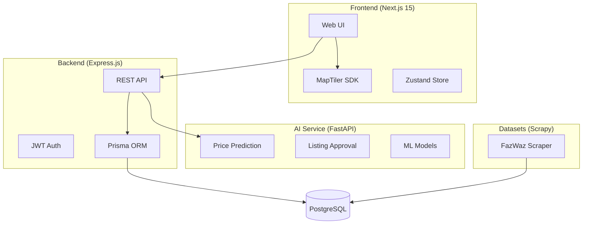

# RentVerse - Codebase Walkthrough

> **Repository**: [kmzafran/uitm-devops-challenge-TopHacker](https://github.com/kmzafran/uitm-devops-challenge-TopHacker)

## Overview

**RentVerse** is a comprehensive Malaysian property rental platform with **4 main microservices**:

| Component | Technology | Port | Purpose |
|-----------|------------|------|---------|
| **Backend** | Express.js + Prisma | 3000 | Core API, authentication, database |
| **Frontend** | Next.js 15 + React 19 | 3000 | Web UI with maps integration |
| **AI Service** | FastAPI + ML | 8000 | Price prediction & listing approval |
| **Datasets** | Python + Scrapy | - | Web scraper for property data |

---

## Architecture Diagram



---

## Component Details

### 1. Backend (`rentverse-backend/`)

**Tech Stack**: Express.js, Prisma ORM, PostgreSQL, JWT, Swagger UI

#### Database Schema (15+ Models)

| Model | Purpose |
|-------|---------|
| `User` | User accounts with OAuth (Google, Facebook, GitHub, Apple, Twitter) + MFA support |
| `Property` | Rental listings with geo-location (PostGIS), images, pricing |
| `PropertyType` | Master types (Apartment, Condo, House, etc.) |
| `Amenity` | Facilities (AC, Pool, Gym, etc.) |
| `Lease` | Rental contracts between landlord and tenant |
| `Invoice` | Billing documents (rent, deposit, utilities) |
| `Payment` | Payment transactions (bank transfer, e-wallet, credit card) |
| `PropertyFavorite` | User wishlists |
| `PropertyRating` | Reviews and ratings |
| `PropertyView` | Analytics tracking |
| `Otp` | OTP codes for MFA (Email/SMS) |
| `RentalAgreement` | Generated PDF agreements |
| `PricePrediction` | ML prediction logs |

#### Key API Endpoints

```
POST /api/auth/register     - User registration
POST /api/auth/login        - JWT authentication
GET  /api/properties        - Property listings
GET  /api/properties/geojson - GeoJSON for maps
POST /api/bookings          - Create lease booking
GET  /api-docs              - Swagger UI
```

#### Files Structure
- `src/app.js` - Express app config
- `prisma/schema.prisma` - Database schema
- `src/modules/` - Feature modules

---

### 2. Frontend (`rentverse-frontend/`)

**Tech Stack**: Next.js 15, React 19, TypeScript, Tailwind CSS 4, Zustand, MapTiler SDK

#### Key Features
- 🔍 Advanced property search with filters
- 🗺️ Interactive map with property markers
- ❤️ Wishlist/favorites system
- 👤 User authentication with MFA
- 🏠 Property listing creation wizard
- 📱 Mobile-responsive design

#### Project Structure
```
app/
├── auth/          # Login, signup pages
├── property/      # Property listings, details, search
├── account/       # User profile management
├── admin/         # Admin dashboard
├── wishlist/      # Saved properties
└── rents/         # Rental management
```

#### State Management
- `stores/authStore.ts` - Authentication state
- `stores/propertiesStore.ts` - Property data & filters

---

### 3. AI Service (`rentverse-ai-service/`)

**Tech Stack**: FastAPI, Python 3.12+, Scikit-learn, Pandas, NumPy, Poetry

#### ML Models
| Model | Algorithm | R² Score | Purpose |
|-------|-----------|----------|---------|
| Price Prediction | Extra Trees Regressor | 84%+ | Predicts rental price in RM |
| Listing Approval | Rule-based + ML | - | Auto-approve/reject listings |

#### API Endpoints
```
POST /api/v1/classify/price    - Simple price prediction
POST /api/v1/classify/approval - Listing approval classification
POST /api/v1/predict/single    - Detailed prediction
POST /api/v1/predict/batch     - Batch processing (up to 100)
GET  /api/v1/health            - Health check
GET  /docs                     - Swagger UI
```

#### Example Request
```bash
curl -X POST "http://localhost:8000/api/v1/classify/price" \
  -H "Content-Type: application/json" \
  -d '{
    "property_type": "Condominium",
    "bedrooms": 3,
    "bathrooms": 2,
    "area": 1200,
    "furnished": "Yes",
    "location": "KLCC, Kuala Lumpur"
  }'
```

---

### 4. Datasets (`rentverse-datasets/`)

**Tech Stack**: Scrapy, Python 3.12+, Poetry

#### Purpose
Web scraper for [FazWaz Malaysia](https://fazwaz.my) property listings.

#### Dataset Statistics
- **Total Properties**: 1,119 listings
- **Top Regions**: Selangor (365), Kuala Lumpur (298), Penang (162), Johor (158)

#### Usage
```bash
# Scrape all properties
poetry run scrapy crawl fazwazrent

# Scrape specific region
poetry run scrapy crawl fazwazrent -a region=kuala-lumpur -a property_type=condo
```

#### Output
Exports to `rentals.csv` with fields: listing_id, title, price, location, bedrooms, bathrooms, area, furnished, images, etc.

---

## Quick Start Guide

### Prerequisites
- Node.js 18+ / Bun
- Python 3.12+
- PostgreSQL
- Poetry

### Backend
```bash
cd rentverse-backend
pnpm install
cp .env.example .env
pnpm run db:migrate
pnpm dev
# API: http://localhost:3000
```

### Frontend
```bash
cd rentverse-frontend
bun install
bun dev
# UI: http://localhost:3000
```

### AI Service
```bash
cd rentverse-ai-service
poetry install
cp .env.example .env
poetry run uvicorn rentverse.main:app --reload --port 8000
# API: http://localhost:8000
```

### Datasets Scraper
```bash
cd rentverse-datasets
poetry install
poetry run scrapy crawl fazwazrent
```

---

## Documentation Files

| File | Description |
|------|-------------|
| `AISERVICESTEP.md` | AI Service setup guide |
| `BACKENDSTEP.md` | Backend setup guide |
| `FRONTENDSTEP.md` | Frontend setup guide |
| `DATASETSTEP.md` | Datasets scraper guide |
| `FixMapDataset.md` | Map marker implementation |

---

## Key Technologies Summary

### Backend Stack
- **Framework**: Express.js
- **ORM**: Prisma with PostgreSQL
- **Auth**: JWT + Passport.js (OAuth)
- **Upload**: Cloudinary + Multer
- **Docs**: Swagger UI
- **Security**: CORS, Helmet, Rate Limiting

### Frontend Stack
- **Framework**: Next.js 15 (App Router)
- **UI**: React 19 + Tailwind CSS 4
- **State**: Zustand
- **Maps**: MapTiler SDK
- **Icons**: Lucide React
- **Carousel**: Swiper

### AI Service Stack
- **Framework**: FastAPI
- **ML**: Scikit-learn (Extra Trees)
- **Data**: Pandas, NumPy
- **Server**: Uvicorn
- **Deps**: Poetry
- **Container**: Docker

### DevOps
- **Package Managers**: pnpm, Bun, Poetry
- **Git Hooks**: Husky
- **Linting**: ESLint, Prettier
- **Type Safety**: TypeScript, Pydantic
- **Container**: Docker Compose

---

*Walkthrough created: December 17, 2024*
